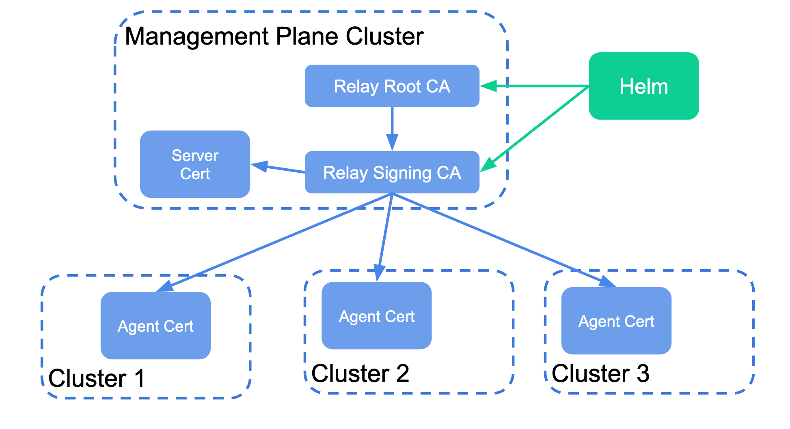

# Certificate Management Strategies

There are a number of ways to manage the required certificates in Gloo Mesh.


## Required Certificates

### Gloo Mesh Agents

Server/Client mTLS certificates are required for communication between the management plane agent (enterprise-networking) and the control plane agents (enterprise-agent) that are deployed to each cluster.

These agent certificates need to share the same root of trust but it is not required to have to be a part of the same root of trust as your Istio deployments. 

1. enterprise-networking (server certificate)
2. enterprise-agent (client certificate) per cluster


### Istio Deployments

Each Istio deployment requires that a CA certificate exists at the kubernetes secret `cacerts` in the `istio-system` namespace. Istio will use this certificate to issue workload certificates to each pod within the mesh. 

1. Istio CA Certificate per cluster


## Gloo Mesh Managed Approach

Gloo Mesh has a number of useful tools to help manage certificates and will be covered below. You must take care to make sure the solutions fit within your security guidelines. 

### Gloo Mesh Autogenerated Root CA for Agents (DEMO ONLY)

By default the gloo mesh helm chart autogenerates its own Root CA certificate and Intermediate Signing CA for issuing server and client certificates to each enterprise-networking and enterprise-agent application. These secrets are stored in the `gloo-mesh` namespace under `relay-root-tls-secret` and `relay-tls-signing-secret`. The enterprise-agent certificate is stored in the `gloo-mesh` namespace on the client cluster under the name `relay-client-tls-secret`




When a new enterprise-agent application joins the gloo mesh management plane, it does so using simple TLS and a token that has been autogenerated within the helm chart. That token is trusted and the enterprise-networking application issues a client certificate to the agent. The agent then drops its connection and reestablishes an mTLS connection with the Management Plane. 


**This is a very handy feature when trying out Gloo Mesh features but should not be used in production.**

This should be avoided in production if possible. The Root CA Certificate and key (unencrypted) are stored in kubernetes secrets. If for some reason they were to get deleted you would need to regenerate new certificates for all relay applications. 

### Gloo Mesh Autogenerated Root CA for Istio (DEMO ONLY)
Gloo mesh has the ability (via VirtualMesh) to generate and self-sign a Root CA certificate using the enterprise-networking application. The application will generate and self-sign a Root CA certificate that will be able to sign Istio Intermediate CA certificates when needed. Gloo Mesh will then place that Intermediate CA certificate in the client cluster under the kubernetes secret `cacerts` in the `istio-system` namespace. 

Using VirtualMesh to autogenerate the Root CA and issue Intermediate CA certificates to each Istio deployment.

```yaml
apiVersion: networking.mesh.gloo.solo.io/v1
kind: VirtualMesh
metadata:
  name: virtual-mesh
  namespace: gloo-mesh
spec:
  # specify gloo mesh certificate policy 
  mtlsConfig:
    # once a new intermediate CA certificate has been given to istio,
    # a restart is required of all pods in the mesh to receive new certificates.
    autoRestartPods: true
    shared:
      # root ca config
      rootCertificateAuthority:
        # autogenerate root CA certificate
        generated: {}
  federation:
    selectors:
    - {}
  meshes:
  - name: istiod-istio-system-cluster-1 
    namespace: gloo-mesh
  - name: istiod-istio-system-cluster-2
    namespace: gloo-mesh
```


**This is a very handy feature when trying out Gloo Mesh features but should not be used in production.**

This should be avoided in production if possible. The Root CA Certificate and key (unencrypted) are stored in kubernetes secrets. If for some reason they were to get deleted you would need to regenerate new certificates gloo mesh and for every Istio deployment. 

### Saving the Autogenerate CA Certificates

It is important that if you rely on the autogenerated certificates, you should download them and store them in a safe location in case they were to ever be lost by the management plane. 

```sh
# Download Relay Root Certificate
mkdir relay-root-tls-secret
kubectl get secret -n gloo-mesh -o jsonpath='{.data.ca\.crt}' relay-root-tls-secret | base64 --decode > relay-root-tls-secret/ca.crt
kubectl get secret -n gloo-mesh -o jsonpath='{.data.tls\.key}' relay-root-tls-secret | base64 --decode > relay-root-tls-secret/tls.key

# Download Relay Signing Certificate
mkdir relay-tls-signing-secret
kubectl get secret -n gloo-mesh -o jsonpath='{.data.ca\.crt}' relay-tls-signing-secret | base64 --decode > relay-tls-signing-secret/ca.crt
kubectl get secret -n gloo-mesh -o jsonpath='{.data.tls\.key}' relay-tls-signing-secret | base64 --decode > relay-tls-signing-secret/tls.key

# For each VirtualMesh
# Download Root Certificate
VIRTUAL_MESH_NAME=gloo-mesh
SECRET_NAME=virtual-mesh.$VIRTUAL_MESH_NAME
mkdir $SECRET_NAME

kubectl get secret -n gloo-mesh -o jsonpath='{.data.root-cert\.pem}' $SECRET_NAME | base64 --decode > $SECRET_NAME/ca.crt
kubectl get secret -n gloo-mesh -o jsonpath='{.data.key\.pem}' $SECRET_NAME | base64 --decode > $SECRET_NAME/tls.key
```

## Using your own CAs

### For Relay


### For Istio CAs
* Kubernetes Secrets
You can bring your own signing certificates and store them as Kuber

* Vault


## ACM Managed Root CAs

It is recommended that your Root CA be secured for security reasons and rotating it can be difficult to implement. If you use ACM it is acceptable for the relay agents and Istio CAs to share the same root certificate. 

Creating a RootCA Certificate can be followed here https://docs.aws.amazon.com/acm-pca/latest/userguide/PcaCreateCa.html

File: ca_config.json
```sh
echo '''
{
   "KeyAlgorithm":"RSA_2048",
   "SigningAlgorithm":"SHA256WITHRSA",
   "Subject":{
      "Country":"US",
      "Organization":"Solo.io",
      "OrganizationalUnit":"Demo",
      "State":"MA",
      "Locality":"Boson",
      "CommonName":"*.gloo-mesh"
   }
}
''' > ca_config.json
aws acm-pca create-certificate-authority \
     --certificate-authority-configuration file://ca_config.json \
     --certificate-authority-type "ROOT" \
     --idempotency-token 01234567 \
     --tags  Key=Name,Value=Gloo-Mesh-RootCA
# Response
# {
#   "CertificateAuthorityArn": "arn:aws:acm-pca:us-east-1:123456789:certificate-authority/123456789-debf-4513-89f7-c1834d5ffbd5"
# }


# Generate Root CA Certificate Request
cat > "root-ca.conf" <<EOF
[req]
req_extensions = v3_req
distinguished_name = req_distinguished_name
[req_distinguished_name]
[ v3_req ]
basicConstraints = critical,CA:TRUE
keyUsage = digitalSignature, keyEncipherment, keyCertSign
extendedKeyUsage = clientAuth, serverAuth
subjectAltName = @alt_names
[alt_names]
DNS = *.gloo-mesh
EOF

openssl req -new -newkey rsa:2048 -nodes -out root-ca.csr -keyout root-ca.key -subj "/CN=gloo-mesh-root-ca" -config "root-ca.conf"

# Upload Root CA CSR (10 Year Root)
aws acm-pca issue-certificate \
     --certificate-authority-arn arn:aws:acm-pca:us-east-1:123456789:certificate-authority/123456789-debf-4513-89f7-c1834d5ffbd5 \
     --csr file://root-ca.csr \
     --signing-algorithm SHA256WITHRSA \
     --template-arn arn:aws:acm-pca:::template/RootCACertificate/V1 \
     --validity Value=3650,Type=DAYS

# Generate Intermediate CA Certificate Request

```


